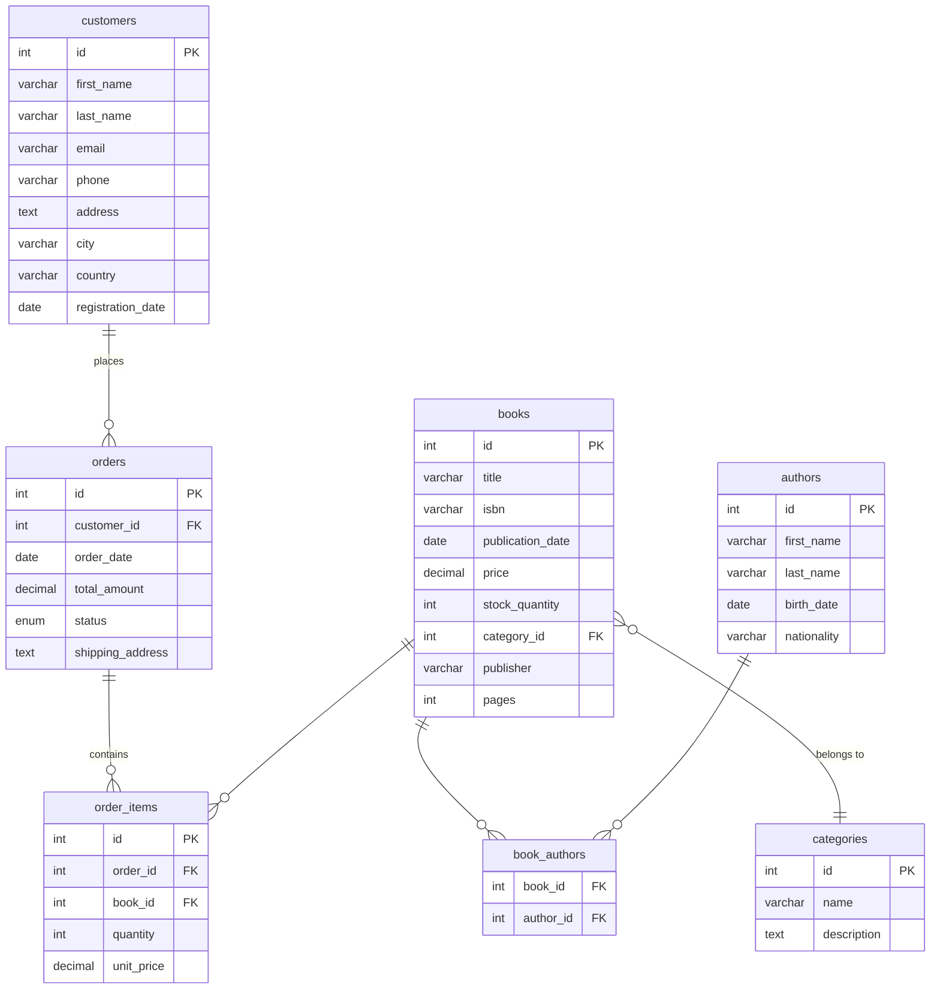

# Ejercicios SQL - Librería Online

## Estructura de la Base de Datos

## Ejercicios

1. Obtener todos los libros con su título, precio y cantidad en stock.

2. Mostrar todos los libros que cuesten más de $20.

3. Listar todos los autores ordenados alfabéticamente por apellido.

4. Encontrar todos los libros cuyo título contenga la palabra "amor".

5. Mostrar todos los libros de las categorías "Ficción" y "Romance".

6. Mostrar todos los libros con el nombre de su categoría.

7. Listar todos los libros con su categoría y autor. Mostrar: título del libro, categoría, nombre completo del autor.

8. Mostrar todas las categorías y la cantidad de libros que tienen (incluyendo categorías sin libros).

9. Obtener todos los pedidos del cliente "Ana González" con los detalles de los libros comprados.

10. Mostrar el historial completo de pedidos incluyendo: nombre del cliente, fecha del pedido, título del libro, cantidad y precio unitario.

11. Mostrar los autores que han escrito libros en más de una categoría.

12. Calcular el valor total del inventario (precio × stock) por categoría.

13. Obtener el precio promedio de los libros por categoría.

14. Encontrar el libro más caro y el más barato de cada categoría.

15. Mostrar las categorías que tienen más de 2 libros.

16. Encontrar todos los libros que son más caros que el precio promedio.

17. Mostrar todos los autores que tienen al menos un libro publicado.

18. Obtener los clientes que han realizado pedidos por un valor superior a $50.

19. Para cada categoría, mostrar el libro más caro de esa categoría.

20. Crear una consulta que muestre el ranking de clientes por total gastado.

21. Clasificar los libros según su precio: "Económico" (<$20), "Medio" ($20-$30), "Caro" (>$30).

22. Mostrar el ranking de libros más vendidos (por cantidad total vendida).

23. Calcular las ventas totales por autor.

24. Mostrar las ventas mensuales del año 2024.

25. Agregar un nuevo libro con su autor correspondiente.

26. Actualizar el precio de todos los libros de la categoría "Tecnología" aumentándolo en un 10%.

27. Mostrar los 5 libros más vendidos con cantidad total y ingresos generados.

28. Mostrar los libros que nunca han sido vendidos.

29. Mostrar los libros con stock bajo (menos de 10 unidades).

30. Mostrar los autores cuyos libros han generado más ingresos.
